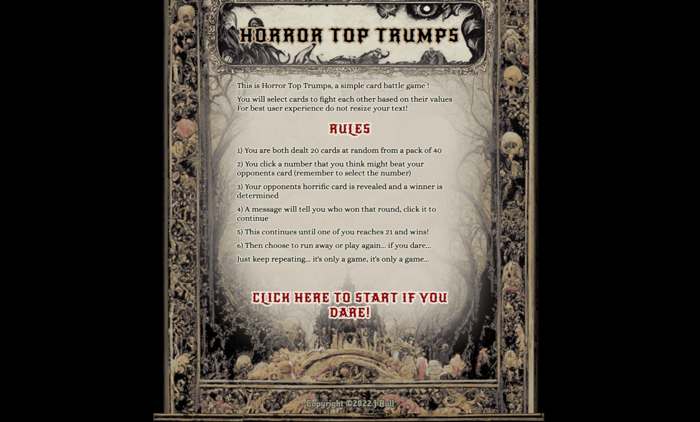
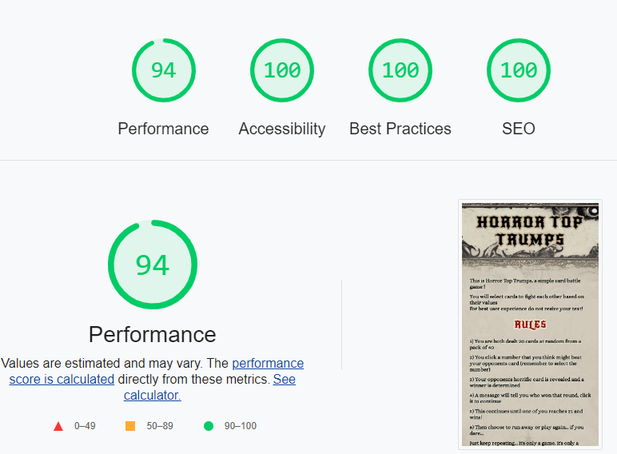

# **HORROR TOP TRUMPS**

Based on the popular card game of the late 80s called top trumps.

This game seeks to give a flavour of the game using some basic javascript.
The subject matter is famous horror film villains.

[Horror Top Trumps Live Site](https://jeffreybull76.github.io/CI_project2/)

-----------------------------------------

## [**Table of Contents**](<#table-of-contents>)
   [**Early Concept / User Experience**](<#early-concept>)
   * [**Design Ethos**](<#design-ethos>)
   * [**Typography**](<#typography>)
   * [**Colors**](<#colors>)
   * [**Coding**](<#coding>)

## [**Development Process**](<#development-process-1>)
   * Git Commits
   * Code Comments

# [**FINAL DESIGN**](<#final-design-1>)

## [**Features**](<#features-1>)
   * [**Landing Page**](<#landing-page>)
   * [**Game Page**](<#game-page>)
   * [**Future roadmap**](<#future-roadmap>)

## [**TECHNOLOGY**](<#technology-1>)
   * HTML5
   * CSS
   * Javascript
   * Gitpod
   * Github
   * GIMP
   * Midjourney

## [**TESTING**](<#testing-1>)
   * [**W3C HTML**](<#w3c-html>)
   * [**JIGSAW**](<#jigsaw-css>)
   * [**JSHINT**](<#jshint>)
   * [**LIGHTHOUSE**](<#lighthouse>)
   * [**UNFIXED BUGS**](<#unfixed-bugs>)

## [**DEPLOYMENT**](<#deployment-1>)
   * To Deploy
   * To Fork
   * To Clone

## [**CONTENT**](<#content-1>)
   * Media & 3rd Party resources

## [**FINAL THOUGHTS**](<#final-thoughts-1>)
   * Lessons learned
   * Acknowledgements

## Early Concept

   * ### Design Ethos
   * The basic design required a simple landing page and a link to the game page
      * I wanted this to have a gothic horror feel in terms of design
      * Midjourney was used to create the graphical elements
      * I wanted the experience to be clear and concise
   * I decided early on to not follow a specific tutorial to build the game. I wanted the experience (for better and worse) of writing something from the ground up. As is detailed below I did use a pre-written randomise function and simply adapted it to the game.
   
   * ## Rough Test Version
   
   * [Link to live site](https://jeffreybull76.github.io/Card_Array_Test/)
   * [Link to git repo](https://github.com/JeffreyBull76/Card_Array_Test)
   
   
   * The above is the first very rough mock-up of how the game page might look. 
   * Bold colours were used for test purposes and all code has console logs left in
   * Code comments were left out as it was purely for my own use. It is provided here to show how the concept went from that to what the site ended up with.
   * I felt it important to test the actual concept outside of writing the project for real to see if it was something I could feasibly complete.
   * You will note this version uses more crude methods such as timeouts to progress the game and has a different win condition (among many other changes) 

[Go back](<#table-of-contents>)
-----------------------------------------

 * ### Typography
 * The fonts chosen for the site were
      * Alice from googlefonts - Using the standard embedded code method
      * New Rocker from font squirrel - This required using their onsite webfont generator and uploading the files to my repo
 * Fonts were chosen to keep in line with the gothic horror feel while remaining readable.

[Go back](<#table-of-contents>)
-----------------------------------------

 * ### Colors
 * The following general color palette was chosen. I wasn't able to narrow this down to 4 specific colours as heavy detailed raster graphics are used extensively so it felt wrong. But overall, the colours used fall into the following general tones.
     * Bone color / yellowy off white
     * Dark black 
     * Reds
 * These were picked to keep in line with the graphical elements and create a washed out dark gothic feeling.
 
[Go back](<#table-of-contents>)
-----------------------------------------

 * ### Coding
 * All code was written from scratch except were explicitly stated below:

   * The splice method was taken from here and adapted for use in my code
     * [Splice method guide](https://thewebdev.info/2022/06/26/how-to-split-array-into-two-arrays-with-javascript/)
 
   * The randomiser code was taken from here and used to shuffle the card array ready for splicing. This was required so that the cards for each player were different each game
     * [Randomiser code](https://javascript.info/task/shuffle)
 
   * The text shadows were created using this code generator 
     * [Text shadow generator](http://owumaro.github.io/text-stroke-generator/)

   * Lessons learned - As the functions and interactions of the game became more complex from the test to live version, many errors were introduced relating to calling functions in the correct order. I attempted to keep the code as clear as possible from errors, but as I was learning while doing it there are some areas that are far more complex and less concise than is required.

[Go back](<#table-of-contents>)
-----------------------------------------

* ### Development process
* Git Commits - I attempted to commit often especially with the complexity of the JS      
* Code Comments - Comments have been added to all files to make future editing easier
* JS comments - I left fairly verbose comments in to describe the more complex code blocks
* What I'd do differently - More so than the first project I feel this one taught me how complex code can become when adding even seemingly small features or ideas. They can exponentially balloon the complexity of said code out of control, and it becomes hard to maintain. This was a very simple 1-page game, it is now more obvious to me than before, how a methodical and clear process would be of paramount importance on a project larger in scope and size.
   
[Go back](<#table-of-contents>)
-----------------------------------------

# **FINAL DESIGN**

## Features

* ### LANDING PAGE
* An early decision was made to have two simple versions of the site across all browsers. As the images used are all detailed raster graphics, I needed to avoid ugly resizing. I felt a mobile or 'small screen' version under 768px in size and a single layout for all screen sizes above that was best.
* The site was designed mobile first and then a media query is used to restyle elements on larger screens. 
* I Received feedback on various early drafts about making the rules clearer. Hopefully the final design conveys the rules of the game in a more concise way.
* As this page is mostly static, I encountered very few problems coding it. Fixed sizes were used to minimise scaling and display issues.
* See below for visual examples

* Full size landing page 
* 
* [Horror Top Trumps Landing Page](https://jeffreybull76.github.io/CI_project2/)
* Mobile size landing page 
* 

-----------------------------------------
   
* ## GAME PAGE

* ### FULL SIZE SITE
* The meat and potatoes (so to speak) of the project rests here. This went through numerous iterations. 
* The full-size version was easier to design, it simply needed the two cards to be displayed in the game area side by side with the computers card hidden.
* Two simple floated score areas sit at the top with a centered background.
* The cards themselves are pulled from the array loaded in a separate JS file.
* This was achieved with a mixture of CSS styles and template literals passed by the JS code to the live page on user interaction.
* ### THE GAME ITSELF
     * On load the array of cards is randomly shuffled and then spliced into two decks of 20, these are held in two arrays the player and computer deck.
     * Once done the 'add listeners' function runs. It first sets the active field with a fairly simple function. This was done to prevent multiple fields being clicked. By having the active field stored in its own variable I was able to isolate the players selection, then remove the listeners until a new card was dealt.
     * Once the on-click listeners run the 'play cards' function executes, which simply checks for a win condition (and removes all values if true) or deals a new card.
     * It loads the values of those cards into the HTML so the player can see their card. Also this 'hides' the computers card setting its 'hidden' values to true. 
         * Within this a template literal was used for loading responsive images which changed based on browser size. The play cards function in simple terms just deals the next card or flips both cards face down when the game is over
     * Each round starts when the player selects a number. It uses listeners on each field to return a value to a corresponding function.
     * It then runs a function which returns the clicked value to two variables 'FieldP' and 'FieldC' these are the values which are used to battle each other.
         * It then unhides the computers card and runs the battle function. This in simple terms simply checks which value wins. It also importantly removes the listeners from all fields. This prevents simply spam clicking the fields while the game is paused and means the player must advance the game to continue.
     * Depending which card won both active cards are then pushed into a new array either playerWins or computerWins respectively, this removes those two cards from the active deck allowing for a new card to be dealt. It then updates the scores by simply counting the length of each array.
     * It also checks for a winner each time the listeners are added and terminates the game if required.
     * If no winner has been determined the whole process loops back round
* ### PROCESS FROM CONCEPT TO LIVE
* Early test version used a simple timeout function to deal a new card after a few seconds of selecting a field as seen [HERE](https://jeffreybull76.github.io/Card_Array_Test/) this was suboptimal as it meant the user lacked control over their experience.
* In the live version a hidden popup div is used (centred and invisible on page load) which then displays when each card battle occurs, this unhides the popup allowing the user to progress the game. 
* This same popup is used at game over to run a new game (simply reloading the page)
* Early version of the game saw both players play until all cards were exhausted. On advice from my mentor this was altered to be the first to 21, which is an unassailable score for either side. 
* 
* [Horror Top Trumps Game Page](https://jeffreybull76.github.io/CI_project2/gamepage.html)

* ### THE CARDS
     * All card info loaded dynamically (see above)
     * Card displays 1 image inside picture element this allows for dynamic resizing
     * Has 4 value fields that the user can select
     * Graphically it remains consistent with the washed-out gothic horror feeling
* 

* ### SMALL SCREEN SITE
* The only real change for the mobile version is in display layout. 
* Early version saw both cards full size one above the other (stacked horizontally) this meant to see the other card scrolling was required. Listening to feedback from my mentor a decision was made to make the computer card smaller. As no interaction with it is required its just for a visual cue, and having the game take place on one page without the need to scroll was preferable.

* Mobile size landing page 
* 

-----------------------------------------

* ### Future roadmap

* More time is need to make the values more competitive. This would require a significant amount of testing to make the game harder to win (and lose) by simply selecting the highest or lowest values. A spreadsheet would be needed to compare all values. Very possible if time consuming, but felt beyond the scope of this project.
* I intended to add sound effects, preferably specific to each character which would play on win or lose. This was beyond the scope of the project in terms of the time I had.
* Clean up the JS and make the functions more concise.
* Another possible feature would be a dealing animation which displayed the cards in both players decks. This would have significantly increased the workload to produce the finished game. Also it would have made the mobile version more difficult to display or simply be redundant on small screens. But it is something to consider.
* If the game required other subjects the landing page could be completely reworked so that you select a deck type, then it loads the relevant theme and deck. Other ideas would be superheroes, cars, dinosaurs etc. This was well beyond the scope of the project but would be fairly easy to do by simply using the same code and altering the graphical elements.

[Go back](<#features>)
-----------------------------------------

-----------------------------------------
* ## Technology
   * HTML - used for main structure of site
   * CSS - external stylesheet used to apply visual style, effect and functionality to the html
   * Javascipt - two external sheets for game code
   * GIThub - used for hosting and editing the site via a repository
   * GITpod - used to deploy the site and edit the code via a workspace in chrome
   * GIMP - open-source raster image editing software used to alter, crop and scale art assets
   * Midjourney - Used for creating art assets
   * Tiny PNG - used to optimize the graphical elements

[Go back](<#table-of-contents>)
-----------------------------------------

* ## Testing

* ### W3C HTML
     * All pages passed validation
     * [Landing page validation](https://validator.w3.org/nu/?doc=https%3A%2F%2Fjeffreybull76.github.io%2FCI_project2%2F)
     * [Game page validation](https://validator.w3.org/nu/?doc=https%3A%2F%2Fjeffreybull76.github.io%2FCI_project2%2Fgamepage.html)

* ### JIGSAW CSS
     * [CSS validation](https://jigsaw.w3.org/css-validator/validator?uri=https%3A%2F%2Fjeffreybull76.github.io%2FCI_project2%2F&profile=css3svg&usermedium=all&warning=1&vextwarning=&lang=en)

* ### JSHINT
     * The only issues returned were multiple instances of 'available in ES6 (use 'esversion: 6') or Mozilla JS extensions (use moz)'
     * To make this code work in older versions felt beyond the scope of this project
     * All other code returned with no errors.

* ### Lighthouse
   * See output for lighthouse tests on each page

   *  Landing Page
   *  
   
   *  Game page
   *  
   *  Low performance due to cache of images and PNG format, possible to fix in future but is acceptable for this version.
   
* ### Unfixed bugs
* No known unfixed bugs I am aware of

[Go back](<#table-of-contents>)
-----------------------------------------

* ## Deployment

   * The site was deployed to GitHub pages. The steps to deploy are as follows: 
   * In the GitHub repository, navigate to the Settings tab 
   * From the source section drop-down menu, select the Master Branch
   * Once the master branch has been selected, the page will be automatically refreshed with a detailed ribbon display to indicate the successful deployment. 
      * The live link can be found - [Here](https://jeffreybull76.github.io/CI_project2/)

* ### Forking the repository
   * A copy of the GitHub Repository can be made by forking the GitHub account. This copy can be viewed and changes can be made to the copy without affecting the original repository. Take the following steps to fork the repository;
   * Log in to GitHub and locate the repository.
   * On the right-hand side of the page inline with the repository name is a button called 'Fork', click on the button to create a copy of the original repository in your GitHub Account.

* ### Cloning the repository
   * Under the repo’s name, click on the code tab.
   * In the Clone with HTTPS section, click on the clipboard icon to copy the given URL.
   * In your IDE of choice, open Git Bash.
   * Change the current working directory to the location where you want the cloned directory to be made.
   * Type git clone, and then paste the URL copied from GitHub.
   * Press enter and the local clone will be created.

[Go back](<#table-of-contents>)
-----------------------------------------

* ## Content
* Sites content uses various images of horror film characters, these are obviously registered TMs and as such cannot be used for any form of income or resale. Only used for the project as its not a site intended for general use.
* The images generated in [Midjourney](https://www.midjourney.com/home/) AI are all under creative commons license.
* The following git repo was used to generate the text outlines [LINK](http://owumaro.github.io/text-stroke-generator/)

[Go back](<#table-of-contents>)
-----------------------------------------

* ## Final Thoughts
* Thank you and big shout outs to my mentor for his ongoing advice, which helped refine the project into something more coherent and usable. As well as the slack community members, who tested the site and provided feedback. 
 
[Go back](<#table-of-contents>)
-----------------------------------------
